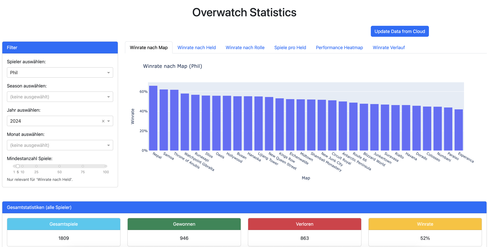

# Overwatch Statistics Dashboard

This is a web application built with Dash and Plotly to visualize and analyze Overwatch match data. The application allows users to filter data by player, season, month, and year, and provides various statistics on heroes, maps, and game modes.



## Features

- **Interactive Filtering**: Filter match data by player, season, year, and month.
- **Winrate Analysis**: Analyze winrates by hero, map, role, and game mode.
- **Performance Heatmap**: Visualize winrates across different maps and roles.
- **Match History**: View a detailed history of recent matches.
- **Configuration**: The project uses a `constants.py` file to store the Google Sheet URL and player names. A `constants.py.example` file is provided as a template.

## Project Structure

```
ow_stats/
├── app.py                      # Main application file
├── callbacks.py                # All Dash callbacks
├── data.py                     # Data loading and caching
├── layout.py                   # Layout of the Dash application
├── utils.py                    # Utility functions
├── requirements.txt            # Python dependencies
├── .gitignore                  # Git ignore file
├── constants.py.example        # Example configuration file
├── assets/                     # Static assets (images)
│   ├── heroes/
│   └── maps/
└── readme.md                   # This file
```

## Setup and Usage

### Prerequisites

- Python 3.6+
- Pip

### Installation

1.  **Clone the repository:**
    ```bash
    git clone https://github.com/your-username/ow_stats.git
    cd ow_stats
    ```

2.  **Create and activate a virtual environment (recommended):**
    ```bash
    python -m venv venv
    source venv/bin/activate  # On Windows, use `venv\Scripts\activate`
    ```

3.  **Configure the application:**
    - Rename `constants.py.example` to `constants.py`.
    - Open `constants.py` and replace the placeholder values with your Google Sheet URL and player names.

4.  **Install the dependencies:**
    ```bash
    pip install -r requirements.txt
    ```

### Running the Application

To run the application, execute the following command in the root directory of the project:

```bash
python app.py
```

The application will be available at `http://127.0.0.1:8050/`.

## How it Works

The application fetches match data from a public Google Sheet, which is then processed and displayed in various interactive charts and tables. The data is cached locally in an Excel file (`local.xlsx`) to avoid downloading it every time the application starts. The "Update Data from Cloud" button can be used to refresh the local data with the latest version from the Google Sheet.